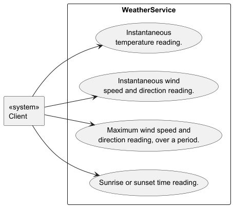
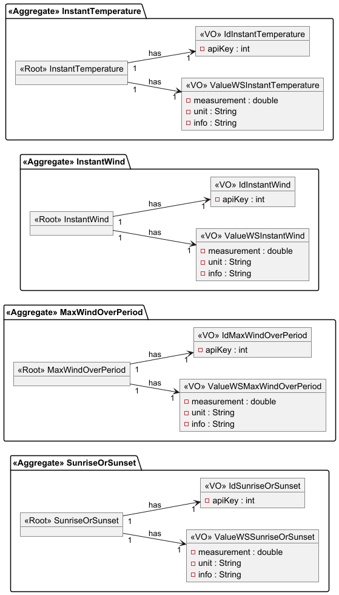
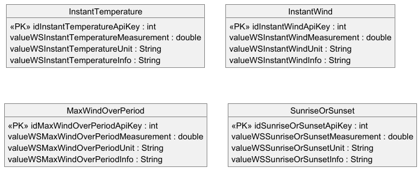
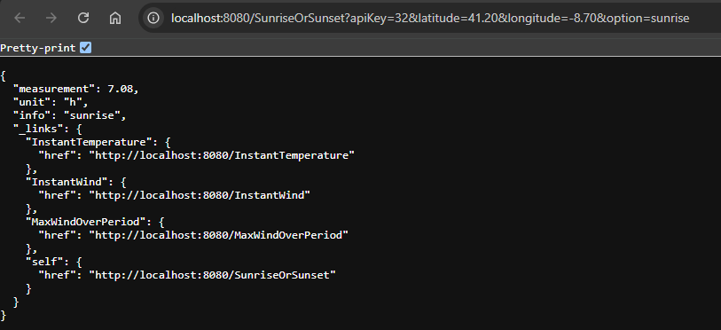

<h1>Weather Service - Sample for Recruiters</h1>

This is a simple backend web server which provides the client with simulated weather data via a RESTful API. 
The project was written in Java with the Spring Boot framework. I am the sole developer of the server.

---

<strong>Table of Contents</strong>

1. [Specifications](#tag1)
2. [Design](#tag2)
3. [User Guide](#tag3)

---

<h2>1. Specifications</h2> <a id="tag1"></a>

... the system shall obtain weather information from a specialized service that is currently under development. 
For the time being, it was defined that a granularity of one hour satisfies the current system's use cases. 
Thus, unless specified otherwise, the weather service provides average or cumulative values over 
an hour.

<br/>

<strong>NON-FUNCTIONAL REQUIREMENTS</strong>

System development will use an agile approach.

The system shall be implemented using the Java programming language using a Test-Driven
Development (TDD) approach. A minimum of 95% line and
mutation coverage is required. Furthermore, automatic and regression tests must adhere to:

- unit tests with isolation of collaborators must be adopted for domain aggregates;

- integration tests must be adopted for controllers.

All code, comments and documentation will be in English.

There must be a project wiki in the GitHub repository to allow for easy access to the updated
system's documentation. The system shall have a visual representation using the C4 and 4+1 models.

<br/>

<strong>PRODUCT BACKLOG</strong>

US01: As Product Owner, I want the weather service to provide the temperature in a
given location in a given instant.

US02: As Product Owner, I want the weather service to provide the wind speed and
direction in a given location in a given instant.

US03: As Product Owner, I want the weather service to provide the maximum wind
speed (and its direction) in a given location over a given period.

US04: As Product Owner, I want the weather service to provide today's sunrise and sunset time.

<br/>

---

<h2>2. Design</h2> <a id="tag2"></a>

Given the aforementioned product backlog, the following use case diagram is the starting point of the design process.



<br/>

As for the domain model, the domain-driven design methodology is adopted.



There are two value-objects in each aggregate: a DomainId constructed with the API key of the client and 
a ValueWS object containing the relevant weather data. This ValueWS object has three attributes: measurement, unit and info. 

For the instantaneous temperature use case, the measurement is a floating point number, the unit is ```C``` and the info is "dry bulb", 
i.e. the objective temperature, as opposed to the thermal sensation or "wet bulb" temperature. 

For the wind related use cases, the measurement is a floating point number representing the velocity, the unit is ```km/h``` and 
the info is the wind direction in radians. 

For the sunrise/sunset use case, the measurement is a floating point number 
representing the sunrise or sunset hour in a decimal format, the unit is ```h``` and the info is the option specified 
on the request, either sunrise or sunset.


<br/>

It is prudent to consider persistence in the early stages of design, therefore the following entity-relationship diagram was drafted.



<br/>

Architecture visualization diagrams are provided in the wiki of this repository, https://github.com/Filipe-A-Cruz/WeatherService/wiki/Architecture-Visual-Model.

<br/>

---

<h2>3. User Guide</h2> <a id="tag3"></a>

To run this project, you'll need to have the following software installed on your machine:

1. JDK 17 or later.
2. Maven 3.9.4 or later.
3. H2 Database Engine 2.2.224 or later (not strictly required, but preferable over the
   embedded version of H2).
4. Your IDE of choice. I've built the app in IntelliJ IDEA.

Once you've cloned the repository and built the project, find the executable file
"WeatherServiceApplication.java" under src/main/java/weatherservice. While the app is running,
you can send the following HTTP requests from either Postman or your web browser.

The following request methods are available at http://localhost:8080
- ```GET``` /InstantTemperature?apiKey=apiKeyValue&latitude=latitudeValue&longitude=longitudeValue&hour=hourValue
- ```GET``` /InstantWind?apiKey=apiKeyValue&latitude=latitudeValue&longitude=longitudeValue&hour=hourValue
- ```GET``` /MaxWindOverPeriod?apiKey=apiKeyValue&latitude=latitudeValue&longitude=longitudeValue&hourStart=hourStartValue&hourEnd=hourEndValue
- ```GET``` /SunriseOrSunset?apiKey=apiKeyValue&latitude=latitudeValue&longitude=longitudeValue&option=optionValue

```apiKeyValue``` is an integer between 1 and 75, inclusive. The app was developed to support the work of 60 students + 15 professors.

```latitudeValue``` is a floating point number between -90.00 and 90.00, inclusive, and ```longitudeValue``` is a floating 
point number between -180.00 and 180.00, inclusive. The product backlog specified the availability of weather data in a 
given location, however, given the simulated nature of said data, the Product Owner felt it was preferable to use the 
same static data set for all GPS coordinates. This data set was sampled from the Porto Metropolitan Area on Nov 1st, 2024.

```hourValue``` is an integer between 0 and 23, inclusive.

```hourStartValue``` and ```hourEndValue``` are also integers between 0 and 23, inclusive, with the caveat that
```hourEndValue``` must be larger than or equal to ```hourStartValue```.

```optionValue``` is a string, either ```sunrise``` or ```sunset```.

<br/>

<strong>EXAMPLE: Requesting Sunrise Time</strong>

While the app is running, open the following address on your web browser:

http://localhost:8080/SunriseOrSunset?apiKey=32&latitude=41.20&longitude=-8.70&option=sunrise

You'll receive a reply stating the sunrise time:



Note that the hour is given in a decimal format, so 7.08h is equivalent to 7h 0.08x60 min = 7h5min.
You'll also notice that the reply includes links to the other resources available on the server, 
following the HATEOAS principle of RESTful API design.

---
